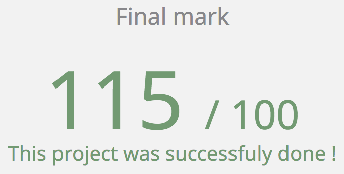

# École 42

## KIFT

The future of voice commands and super cool robot assistants

The project's idea is to teach the voice recognition library Sphinx to recognize
your voice and commands. The system should be able to respond with a computer
generated voice and sound clips. Finally, there's a server for storing and
reacting to the data, and a client for connecting to the system.
The server must be programmed in C, however, the client may be programmed in
any language desired. The server's code must follow the norm,
but can be defended with a reasonable deviation.

### Setup

Run `sh build.sh` to compile and setup the program.

*All the dependencies will be installed by running the script...*

### Executing

To run the project:

`./kift 8080`

`electron kift-client/main.js`

*Both programs need to run at the same time!
Run the server first, please :)*

#### Try it!

Try saying one of the following commands:

`Kevin, time`

`Kevin, screenshot`

`Kevin, lights`

`Kevin, invert colors`

## Screenshots

**Start the program:**

**Program running:**

## TODO

- Man page
- More commands
